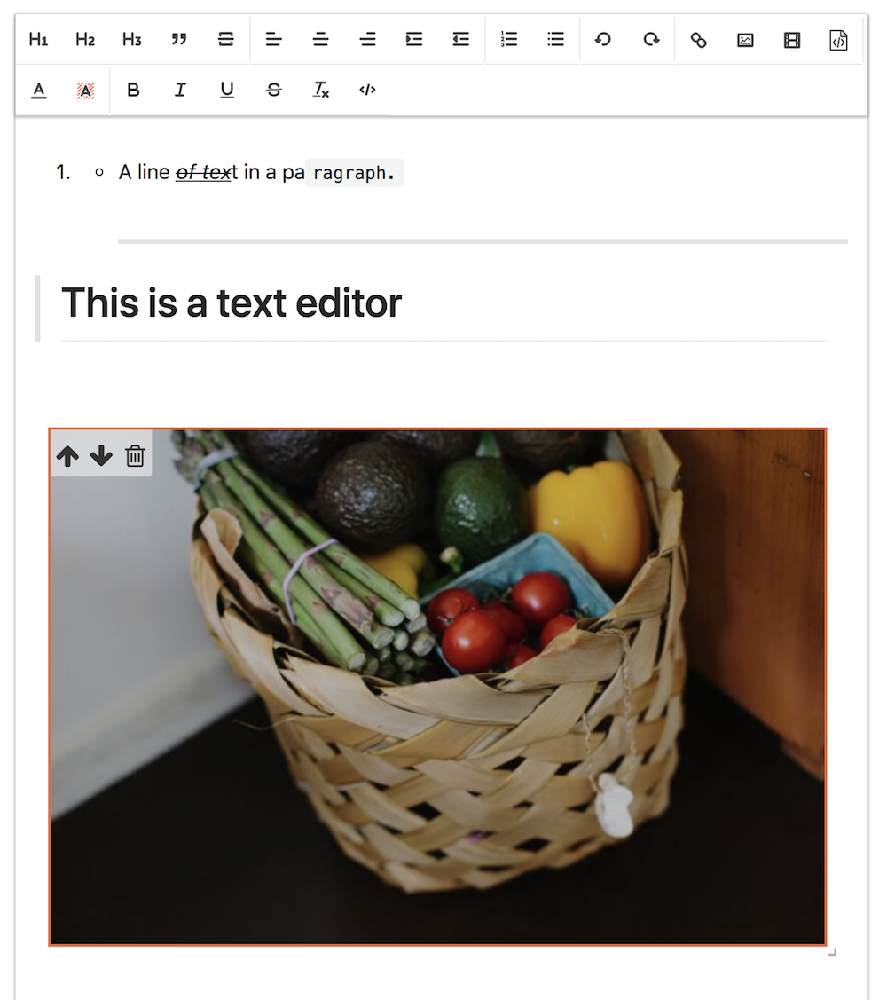

# canner-slate-editor [![NPM version][npm-image]][npm-url]  [![Dependency Status][daviddm-image]][daviddm-url]
> Another rich text editor using [Slate framework](https://docs.slatejs.org) with toolbar support 



## Installation

```sh
$ npm install --save canner-slate-editor
```

## Usage

see https://github.com/Canner/canner-slate-editor/blob/master/docs/index.js

## Start example server

```
npm start
```

## License

MIT [Canner](https://www.canner.io)


[npm-image]: https://badge.fury.io/js/canner-slate-editor.svg
[npm-url]: https://npmjs.org/package/canner-slate-editor
[travis-image]: https://travis-ci.org/Canner/canner-slate-editor.svg?branch=master
[travis-url]: https://travis-ci.org/Canner/canner-slate-editor
[daviddm-image]: https://david-dm.org/Canner/canner-slate-editor.svg?theme=shields.io
[daviddm-url]: https://david-dm.org/Canner/canner-slate-editor
